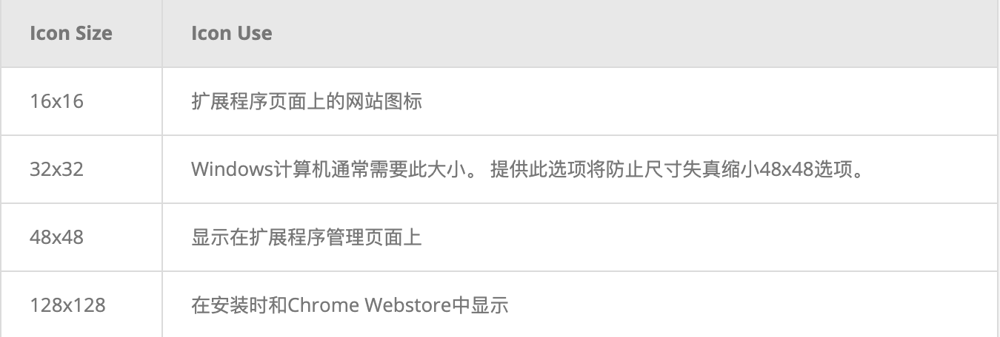

## 设计交互界面

扩展的交互界面应该是有目的且最简单的。 就像扩展本身一样，界面 UI 应该是自定义或能增强浏览体验，而不会分散用户注意力。

本指南探讨了必需的和可选的用户界面功能，了解如何以及何时在扩展中实现不同的 UI 元素。

### 在所有页面上激活扩展

当扩展程序的功能在大多数情况下都可以使用时，请使用 [browser_action](https://developer.chrome.com/browserAction) 。

#### 注册 browser_action

browser_action 在 manifest 中注册。

```
  {
    "name": "My Awesome browser_action Extension",
    ...
    "browser_action": {
      ...
    }
    ...
  }
```

声明 browser_action 会使图标保持彩色，表示扩展名可供用户使用。

#### 增加标记

标记在浏览器图标上方会显示一个彩色横幅，最多包含四个字符。它们只能在其 manifest 中声明 browser_action 的扩展使用。

使用标记显示扩展的状态。 [Drink Water Event](https://developer.chrome.com/extensions/samples#search:drink) 示例显示带有 ON 的标志，以向用户显示他们已成功设置警报，而在扩展空闲时不显示任何内容。
 

通过调用 [chrome.browserAction.setBadgeText](https://developer.chrome.com/browserAction#method-setBadgeText) 设置标记文本，并通过调用[chrome.browserAction.setBadgeBackgroundColor](https://developer.chrome.com/browserAction#method-setBadgeBackgroundColor) 设置横幅颜色。

``` js
chrome.browserAction.setBadgeText({text: 'ON'});
  chrome.browserAction.setBadgeBackgroundColor({color: '#4688F1'});
```

### 在所选页面上激活扩展名

当扩展程序的功能仅在定义的情况下可用时，请使用 [page_action](https://developer.chrome.com/pageAction)。


#### 定义 Page Action

page_action 在 manifest 中注册。

```
  {
    "name": "My Awesome page_action Extension",
    ...
    "page_action": {
      ...
    }
    ...
  }
```

声明 page_action 只会在扩展对用户可用时使图标着色，否则它将以灰度显示。

 

#### 定义激活扩展的规则
 
通过在后台脚本中的 [runtime.onInstalled](https://developer.chrome.com/runtime#event-onInstalled) 监听器下调用 [chrome.declarativeContent](https://developer.chrome.com/declarativeContent) 来定义扩展何时可用的规则。[Page action by URL](https://developer.chrome.com/samples#search:page%20action%20by%20url) 这个扩展设置了一个条件，即网址必须包含“g”。如果满足条件，则扩展将调用[declarativeContent.ShowPageAction()](https://developer.chrome.com/pageAction#method-show)。

```js
  chrome.runtime.onInstalled.addListener(function() {
    // Replace all rules ...
    chrome.declarativeContent.onPageChanged.removeRules(undefined, function() {
      // With a new rule ...
      chrome.declarativeContent.onPageChanged.addRules([
        {
          // That fires when a page's URL contains a 'g' ...
          conditions: [
            new chrome.declarativeContent.PageStateMatcher({
              pageUrl: { urlContains: 'g' },
            })
          ],
          // And shows the extension's page action.
          actions: [ new chrome.declarativeContent.ShowPageAction() ]
        }
      ]);
    });
  });
```

#### 激活禁用扩展

使用 page_action 的扩展可以通过调用pageAction.show 和 pageAction.hide 来动态激活和禁用。

[Mappy](https://developer.chrome.com/extensions/samples#search:mappy) 示例将扫描网页中的地址，并在弹出窗口的静态地图上显示其位置。由于扩展取决于页面内容，因此无法声明规则来预测哪些页面将是相关的。相反，如果在页面上找到地址，它将调用 pageAction.show 使图标变色并表示该扩展名在该选项卡上可用。

```js
chrome.runtime.onMessage.addListener(function(req, sender) {
    chrome.storage.local.set({'address': req.address})
    chrome.pageAction.show(sender.tab.id);
    chrome.pageAction.setTitle({tabId: sender.tab.id, title: req.address});
  });
```

### 提供扩展图标

扩展程序至少需要一个图标来表示它。尽管可以接受 WebKit 支持的任何格式，包括 BMP，GIF，ICO 和 JPEG，但以 PNG 格式提供的图标可以提供最佳视觉效果。

#### 指定工具栏图标

工具栏指定的图标注册在 manifest 中 browser_action 或 page_action 下的default_icon 字段中。鼓励包含多个尺寸以适应16*16 空间。 建议至少使用 16x16 和 32x32 尺寸。

```
 {
    "name": "My Awesome page_action Extension",
    ...
    "page_action": {
      "default_icon": {
        "16": "extension_toolbar_icon16.png",
        "32": "extension_toolbar_icon32.png"
      }
    }
    ...
  }
```

所有图标应为正方形，否则可能会变形。如果没有提供图标，则 Chrome 会将通用图标添加到工具栏。

#### 创建注册额外的图标

在工具栏外使用以下尺寸的其他图标。



在 manifest 中的 “icons” 字段下注册图标。

```

  {
    "name": "My Awesome Extension",
    ...
    "icons": {
      "16": "extension_icon16.png",
      "32": "extension_icon32.png",
      "48": "extension_icon48.png",
      "128": "extension_icon128.png"
    }
    ...
  }
```

### 其他 UI 功能

#### popup 弹出窗口

弹出窗口是一个 HTML 文件，当用户单击工具栏图标时，它将显示在特殊窗口中。弹出窗口的工作原理与网页非常相似；它可以包含指向样式表和脚本标签的链接，但不允许内联 JavaScript。

[Drink Water Event](https://developer.chrome.com/extensions/samples#search:drink)示例弹出窗口显示可用的计时器选项。用户通过点击提供的按钮之一来设置警报。


``` html
 <html>
    <head>
      <title>Water Popup</title>
    </head>
    <body>
        
        <button id='sampleSecond' value='0.1'>Sample Second</button>
        <button id='15min' value='15'>15 Minutes</button>
        <button id='30min' value='30'>30 Minutes</button>
        <button id='cancelAlarm'>Cancel Alarm</button>
     <script src="popup.js"></script>
    </body>
  </html>
```

可以在 manifest 中的 browser action 或 page action 下注册弹出窗口。

```
  {
    "name": "Drink Water Event",
    ...
    "browser_action": {
      "default_popup": "popup.html"
    }
    ...
  }
```

也可以通过调用 browserAction.setPopup 或pageAction.setPopup 动态设置弹出窗口。

``` js
chrome.storage.local.get('signed_in', function(data) {
    if (data.signed_in) {
      chrome.browserAction.setPopup({popup: 'popup.html'});
    } else {
      chrome.browserAction.setPopup({popup: 'popup_sign_in.html'});
    }
  });
```

#### Tooltip 工具提示

将鼠标悬停在浏览器图标上时，请使用工具提示向用户提供简短说明或说明。


工具提示注册在 browser_action 或 page_action 的 default_title 字段下

```
 {
  "name": "Tab Flipper",
   ...
    "browser_action": {
      "default_title": "Press Ctrl(Win)/Command(Mac)+Shift+Right/Left to flip tabs"
    }
  ...
 }
```

也可以通过调用 browserAction.setTitle 和pageAction.setTitle 来设置或更新工具提示。

``` js
chrome.browserAction.onClicked.addListener(function(tab) {
    chrome.browserAction.setTitle({tabId: tab.id, title: "You are on tab:" + tab.id});
  });
```

专用语言环境字符串是通过[国际化](https://developer.chrome.com/i18n)实现的。创建目录以将特定于语言的消息放在名为_locales 的文件夹中。下图显示了支持英语和西班牙语语言环境的扩展名的文件路径。


在每种语言的 messages.json 中的格式化消息。

```
  {
    "__MSG_tooltip__": {
        "message": "Hello!",
        "description": "Tooltip Greeting."
    }
  }
```

```
{
    "__MSG_tooltip__": {
        "message": "Hola!",
        "description": "Tooltip Greeting."
    }
  }
```

在工具提示字段中包括消息的名称，而不是在消息中启用本地化。

```
  {
  "name": "Tab Flipper",
   ...
    "browser_action": {
      "default_title": "__MSG_tooltip__"
    }
  ...
 }
```

#### Omnibox 地址栏

用户可以通过地址栏调用扩展功能。在 manifest 中包括 Omnibox 字段，并指定一个关键字。[Omnibox New Tab Search](https://developer.chrome.com/extensions/samples#search:omnibox%20new)示例使用 “nt” 作为关键字。

```
  {
    "name": "Omnibox New Tab Search",\
    ...
    "omnibox": { "keyword" : "nt" },
    "default_icon": {
      "16": "newtab_search16.png",
      "32": "newtab_search32.png"
    }
    ...
  }
```

当用户在地址栏中输入 “nt” 时，它将激活扩展。 为了向用户发出信号，它会对提供的 16x16 图标进行灰度处理，并将其包含在扩展名旁边的地址栏中。


该扩展程序监听 omnibox.onInputEntered 事件。触发后，扩展程序将打开一个新选项卡，其中包含用户输入的 Google 搜索。

``` js
chrome.omnibox.onInputEntered.addListener(function(text) {
  // Encode user input for special characters , / ? : @ & = + $ #
  var newURL = 'https://www.google.com/search?q=' + encodeURIComponent(text);
  chrome.tabs.create({ url: newURL });
});
```

#### Context Menu 上下文菜单

通过在 manifest 中赋予 “contextMenus” 权限来添加新的上下文菜单选项。

```
  {
    "name": "Global Google Search",
    ...
    "permissions": ["contextMenus", "storage"],
    "icons": {
      "16": "globalGoogle16.png",
      "48": "globalGoogle48.png",
      "128": "globalGoogle128.png"
   }
   ...
  }
```

16x16 图标显示在新菜单项的旁边。


通过在后台脚本中调用 [contextMenus.create](https://developer.chrome.com/contextMenus#method-create) 来创建上下文菜单。这应该在 [runtime.onInstalled](https://developer.chrome.com/runtime#event-onInstalled) 监听器事件下完成。

``` js
 chrome.runtime.onInstalled.addListener(function() {
    for (let key of Object.keys(kLocales)) {
      chrome.contextMenus.create({
        id: key,
        title: kLocales[key],
        type: 'normal',
        contexts: ['selection'],
      });
    }
  });
```

``` js
const kLocales = {
    'com.au': 'Australia',
    'com.br': 'Brazil',
    'ca': 'Canada',
    'cn': 'China',
    'fr': 'France',
    'it': 'Italy',
    'co.in': 'India',
    'co.jp': 'Japan',
    'com.ms': 'Mexico',
    'ru': 'Russia',
    'co.za': 'South Africa',
    'co.uk': 'United Kingdom'
  };
```

Global Google Search context menu 示例从 [locales.js](https://developer.chrome.com/extensions/examples/api/contextMenus/global_context_search/locales.js) 中的列表创建多个选项。如果扩展程序包含多个上下文菜单，则 Google Chrome 浏览器会自动将其折叠为一个父菜单。


#### Commands 命令

扩展可以定义特定的命令并将其绑定到组合键。 在 manifest “commands”字段下注册一个或多个命令。

```
  {
    "name": "Tab Flipper",
    ...
    "commands": {
      "flip-tabs-forward": {
        "suggested_key": {
          "default": "Ctrl+Shift+Right",
          "mac": "Command+Shift+Right"
        },
        "description": "Flip tabs forward"
      },
      "flip-tabs-backwards": {
        "suggested_key": {
          "default": "Ctrl+Shift+Left",
          "mac": "Command+Shift+Left"
        },
        "description": "Flip tabs backwards"
      }
    }
    ...
  }
```

命令可用于提供新的或替代的浏览器快捷方式。 [Tab Flipper](https://developer.chrome.com/extensions/samples#search:tab%20flipper) 监听后台脚本中的 [commands.onCommand](https://developer.chrome.com/commands#event-onCommand) 事件，并定义每个已注册组合的功能。

``` js
chrome.commands.onCommand.addListener(function(command) {
    chrome.tabs.query({currentWindow: true}, function(tabs) {
      // Sort tabs according to their index in the window.
      tabs.sort((a, b) => { return a.index < b.index; });
      let activeIndex = tabs.findIndex((tab) => { return tab.active; });
      let lastTab = tabs.length - 1;
      let newIndex = -1;
      if (command === 'flip-tabs-forward')
        newIndex = activeIndex === 0 ? lastTab : activeIndex - 1;
      else  // 'flip-tabs-backwards'
        newIndex = activeIndex === lastTab ? 0 : activeIndex + 1;
      chrome.tabs.update(tabs[newIndex].id, {active: true, highlighted: true});
    });
  });
```

命令还可以创建与它的扩展特别配合的键绑定。 [Hello Extensions](./what-is-extensions.md) 示例给出了打开弹出窗口的命令。

```
 {
    "name": "Hello Extensions",
    "description" : "Base Level Extension",
    "version": "1.0",
    "browser_action": {
      "default_popup": "hello.html",
      "default_icon": "hello_extensions.png"
    },
    "manifest_version": 2,
    "commands": {
      "_execute_browser_action": {
        "suggested_key": {
          "default": "Ctrl+Shift+F",
          "mac": "MacCtrl+Shift+F"
        },
        "description": "Opens hello.html"
      }
    }
  }
```

由于扩展定义了 broswer_action，因此可以在命令中指定 “execute_browser_action” 以打开弹出文件，而无需包含后台脚本。如果使用 page_action，则可以将其替换为 “execute_page_action”。 浏览器命令和扩展程序命令都可以在同一扩展程序中使用。


#### Override Pages 覆盖页面

扩展程序可以覆盖历史记录，新建选项卡或书签网页，并用自定义 HTML 文件替换。像弹出窗口一样，它可以包含专门的逻辑和样式，但不允许内联 JavaScript。单个扩展名仅限于覆盖三个可能的页面之一。

在 manifest 的 “chrome_url_overrides” 字段下注册替代页面。

```
  {
    "name": "Awesome Override Extension",
    ...

    "chrome_url_overrides" : {
      "newtab": "override_page.html"
    },
    ...
  }
```

覆盖这些页面时，应将 “newtab” 字段替换为“bookmarks” 或 “history”。

``` html
  <html>
   <head>
    <title>New Tab</title>
   </head>
   <body>
      <h1>Hello World</h1>
    <script src="logic.js"></script>
   </body>
  </html>
```


-------

关注 微信公众号「**程序化思维**」 获取最新 Chrome 插件开发教程。


